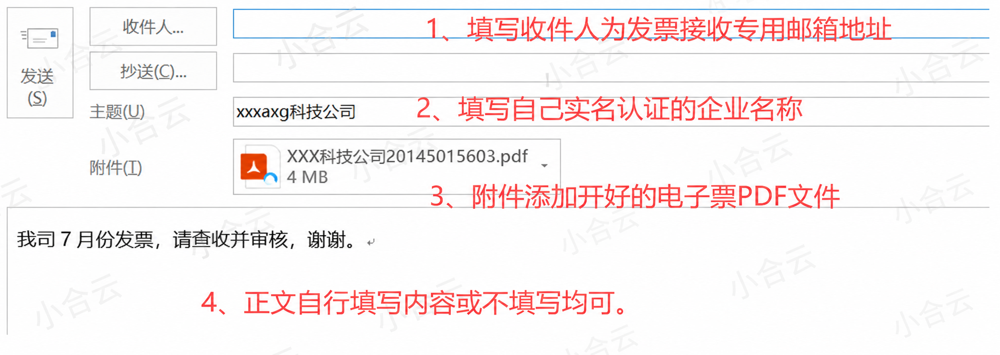
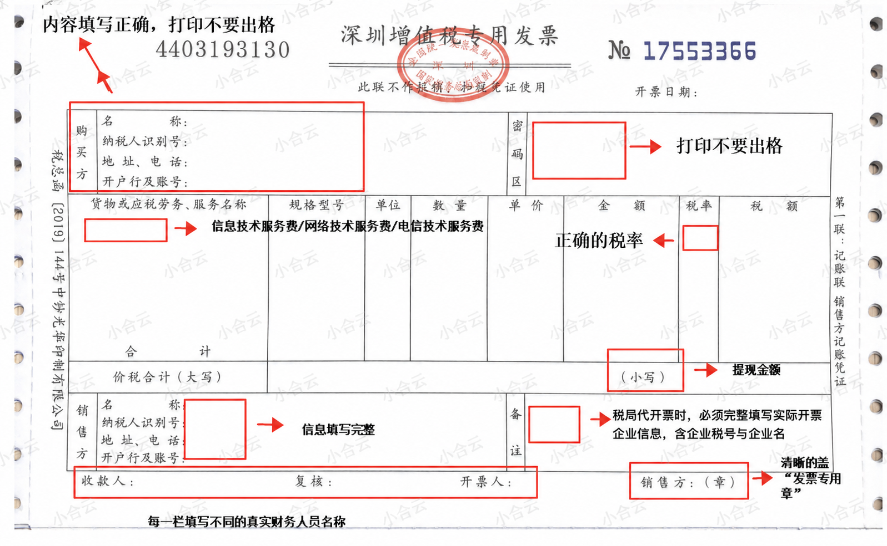

# 企业用户发票开具须知

## 适用范围

发票提交前请确认以下事项：

1. 发票类型为电子增值税专用发票。
2. 发票金额与当月提现总金额完全一致，并准确到分。
3. 购买方开票信息、发票类目、发票专用章等内容准确、清晰、完整。

## 发票提交方式

### 电子发票

仅支持提交电子发票。发送邮件时，请在邮件标题中注明企业名称，便于快速匹配提现主体。

| 项目 | 内容 |
| --- | --- |
| 收票邮箱 | business@csxhcloud.com |
| 邮件标题 | 企业名称 + 发票用途说明 |

## 开票信息

请按以下购买方信息开具发票。开票前请逐项核对，因信息错误导致发票无法认证或抵扣的，需重新开具。

| 项目 | 内容 |
| --- | --- |
| 名称 | 长沙小合科技有限公司 |
| 税号 | 91430104MA4RNN0J28 |
| 单位地址 | 湖南省长沙市岳麓区岳麓街道银杉路31号绿地时代广场5栋3105-1室 |
| 电话 | 18229958857 |
| 开户银行 | 长沙银行股份有限公司营业部 |
| 银行账户 | 810000262748699999 |

## 发票类目

发票类目应符合实际业务及税法规定。可参考以下类目路径，具体第三级类目请根据企业实际情况填写：

1. `电信服务 > 增值电信服务 > 其他增值电信服务`
2. `电信服务 > 其他增值电信服务 > 技术服务费`
3. `生产生活服务 > 信息技术服务 > 信息系统服务`
4. `现代服务 > 信息系统服务 > 信息技术服务费`
5. 其他符合税法规定且与实际业务一致的发票内容

## 开票金额

开票金额必须与当月提现总金额完全一致，且准确到分。金额不得多开或少开。

示例：当月提现总金额为 `4566.78` 元时，发票金额应开具为 `4566.78` 元。

## 提交时间与审核时效

每月 5 日内，需将上一个自然月的提现发票通过邮件提交至小合科技。发票提交时间以邮件成功发送时间为准。

示例：

1. 6 月份提现发票需在 7 月 5 日前发送。
2. 7 月份提现发票需在 8 月 5 日前发送。

小合科技将在收到发票后的 7 个工作日内完成审核。发票验证合格后，可继续提现；如延迟提交或发票信息有误，将影响提现进度。

## 发票参考模板

以下模板仅供参考，实际开票内容应以企业实际业务、提现金额及税法规定为准。

## 常见问题

### 发票可以加盖财务专用章或公章吗？

不可以。发票应加盖发票专用章。

### 发票既盖了财务专用章，又盖了发票专用章，可以使用吗？

不可以。发票上只需加盖发票专用章。

### 发票专用章不清晰，应如何处理？

可在旁边补盖一个清晰的发票专用章；如仍无法识别，请将原发票作废或红冲后重新开具。

### 税局代开的发票如何盖章？

税局代开的增值税专用发票，需由收款方加盖发票专用章，不需要加盖税务机关代开发票专用章。

## 发票无法认证的常见情形

经认证存在以下任一情形的，不得作为增值税进项税额抵扣凭证：

1. 无法认证：专用发票所列密文或明文不能辨认，无法产生认证结果。
2. 纳税人识别号认证不符：专用发票所列购买方纳税人识别号有误。
3. 专用发票代码、号码认证不符：专用发票所列密文解译后与明文的代码或号码不一致。

## 错误发票处理

如发票开具错误，请将原发票作废或红冲后重新开具，并通过邮件重新提交正确的电子发票。
